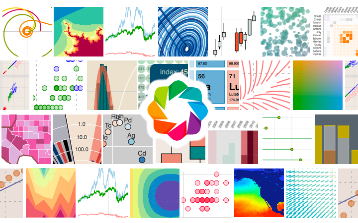

> **Figure 1:** Example of Bokeh Visualization
(bokeh_photo.png)

# The importance of data visualisation

Data, often referred to as the "oil of the future," needs to be understood and explained clearly. Visualizing data through charts and graphs can make thousands of rows and columns of data much easier to comprehend, often turning a seemingly complex situation into something straightforward. This is where the concept of data visualization comes into play.

Data visualization allows data scientists, analysts, and programmers to quickly gain insights into their data. It also aids in making analysis results more understandable and impactful during presentations.

In this article, we will explore one of the visualization libraries for Python users, the **Bokeh** library.

## Bokeh 🌐

Bokeh is a Python-based data visualization library. It’s a powerful tool for Python users, enabling them to create interactive, engaging, and impressive visualizations.

### Advantages of the Bokeh Library 🎯

Here are some of the key strengths that set Bokeh apart from other data visualization libraries:

#### Interactive Visualization 🖱️

Bokeh stands out with its rich interactive visualization capabilities. Users can perform interactions such as zooming, panning, selecting, and searching directly on the charts. This makes exploratory data analysis more engaging.

#### Web Support 🌍

Another design advantage of Bokeh is its seamless integration with web-based applications and visualizations. Bokeh works well with HTML, CSS, and JavaScript. This feature offers great advantages for embedding data visualizations into web-based projects.

#### Multi-Platform Support 🛠️

In addition to being used in Python-developed applications, Bokeh can be utilized in platforms like Jupyter Notebook, JupyterLab, Flask, and Django. This flexibility makes Bokeh a user-friendly library that can be employed in various environments and projects.

#### Drawing Flexibility 🎨

Bokeh offers various options and features for customizing drawings. Simply put, Bokeh is designed for creating more personalized visuals. Users can customize the style, color palettes, labels, and axes of the charts. Advanced drawing features like layered charts, shadows, and background images are also available.

#### Suitability for Large Datasets

One of the most significant features of Bokeh is its ability to work comfortably with large datasets. Bokeh can process and visualize large datasets efficiently. As the dataset size increases, Bokeh’s performance does not degrade, and it continues to work quickly. This feature provides a great advantage in scalable data analysis projects.

These advantages are some of the key arguments that differentiate Bokeh from other data visualization libraries. In short, Bokeh offers users a powerful and interactive visualization opportunity.

### Installing the Bokeh Library

To use Bokeh, you first need to install the library. You can easily install Bokeh using the pip package manager. Use the following command to install Bokeh:

```pythonbash
pip install bokeh
```python
